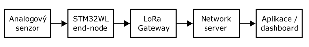

<h1 align="center">
Semestrální projekt z předmětu MPC-SSY
</h1>
Tento projekt implementuje jednoduchou end-node LoRa aplikaci. Dané zařízení je určeno k periodickému čtení dat z analogového senzoru, která následně odesílá přes LoRaWAN síť na network server.   

## Použitý hardware
### Seznam použitých komponent 
- nucleo board typu STM32-WL55JC1
- analogový senzor pro měření výšky hladiny  

###  Propojení pinů - Pinout
| Pin | Funkce |
|---|---|
| PB14 | ADC_IN1 – analogový vstup ze senzoru |
| LED1 | 
 Stavová LED 
|
| LED2 | Stavová LED |
| LED3 | Stavová LED |
 

## Popis software 
### LoRa example
Prvotní základ celého projektu vychází z example LoRa aplikace LoRaWAN_End_Node_LBM, který implementuje LoRaWAN end-node zařízení, které se po spuštění připojí do LoRaWAN sítě pomocí OTAA aktivace a následně periodicky odesílá aplikační data na network server. 

Pro realizaci komunikace slouží Sub-GHz rádio integrované v mikrokontroléru STM32WL a LoRaWAN middleware stack. Aplikace obsahuje debug UART rozhraní a má implementovánu obsluhu pro různé příchozí eventy, jako je obecný ALARM, TXDONE - odeslání dat, DOWNDATA - příjem dat a další. Dále je zajištěna podpora pro periodické posílání aplikačních dat na network server.  

### Přidané funkce 
K výše popsané základní aplikaci jsou dále uživatelsky implementovány vlastní funkce za účelem:
- práci s periferií ADC
- návrh vlastního aplikačního payloadu
- serializaci dat za pomoci *union* struktury
- parsování zařízením přijatých dat
- rozšíření UART debuggingu payloadů

Níže bude každý z těchto bodů rozveden spolu s podrobnějším popisem a důvody této změny.

### Práce s periferií ADC
Rozšíření v podobě práce s A/D převodníkem bylo provedeno za pomoci Cube MX, byl vytvořen základ pro čtení analogových hodnot z externího senzoru hladiny přes pin PB14 / ADC_IN1. Jedná se o 12bitový A/D převodník (s hodnotami 0 - 4095). Hodnota převodníku je přečtena za pomoci funkce *ReadWater()*, avšak chybí převedení na hodnotu vzdálenosti - tedy kalibrace. Hodnota z převodníku je odesílána jako pole "humidity" namísto původní hodnoty vlhkosti vyplňované v example.    

### Návrh vlastního aplikačního payloadu za pomoc struktury *union*
Pro vytvoření vlastního LoRa payloadu byl použit datový typ *union*, za pomoci něhož byla vytvořena datová struktura *lora_payload_t*. K jednotlivým hodnotám je přistupováno přes atribut *data* (např. *payload.data.temperature*). Struktura je označena atributem *__packed__* pro správné zarovnání a vícebajtové parametry jsou převedeny pomocí funkce  *__builtin_bswap16()* za účelem zajištění jednotného pořadí bajtů v odesílaných datech. Druhou částí payloadu je poté regionálně závislá část (868/915) - např. zeměpisná poloha. 

Datový typ *union* byl použit z důvodů, že původní example aplikace vytvářela payload ručním zapisováním jednotlivých bajtů do odesílacího bufferu, přičemž tento přístup je u větších payloadů nepřehledný a zvyšuje riziko chyb při práci s offsety a endianitou.

### Parsování zařízením přijatých dat 
V rámci aplikace byla implementována funkce pro parsování přijatých dat - převedení binárního payloadu nazpět do strukturované podoby jednotlivých parametrů. Pro parsování je využita stejná datová struktura *lora_payload_t*, která se používá při vytváření payloadu pro odesílání. Přijatý buffer je zkopírován funkcí *memcpy()* do union struktury pro pohodlný přístup k jednotlivým položkám payloadu přes proměnné. 

Funkci ovšem nebylo možné řádně otestovat vzhledem k problémům s příjmem dat. Zařízení používá při každém periodickém uplinku dvě downlink okna RX1 a RX2, avšak ani v jednom z nich nebylo docíleno příjmu dat, LoRa zařízení v rámci těchto oken nezaznamenalo událost DOWNDATA. Příčinou může být zřejmě neúspěšná komunikace mezi serverem a zařízením nebo špatná konfigurace timing parametrů, avšak tyto příčiny jsou pouze odhadovány. Komunikace uplinku je bezproblémová. 

### Rozšíření UART debuggingu payloadů 
Pro přehlednost při debuggingu pomocí rozhraní UART byla přidána vrstva výpisů ohledně hodnot právě odesílaných dat nebo číselné identifikační hodnoty právě proběhnutého eventu.

## Nedotatky a podněty ke zlepšení 
Nedostatky byly popsány v kapitolách výše a v zásadě se jedná o kalibraci připojeného senzoru na konkrétní hodnoty, a především problém s přijímáním dat ze strany network serveru.  
